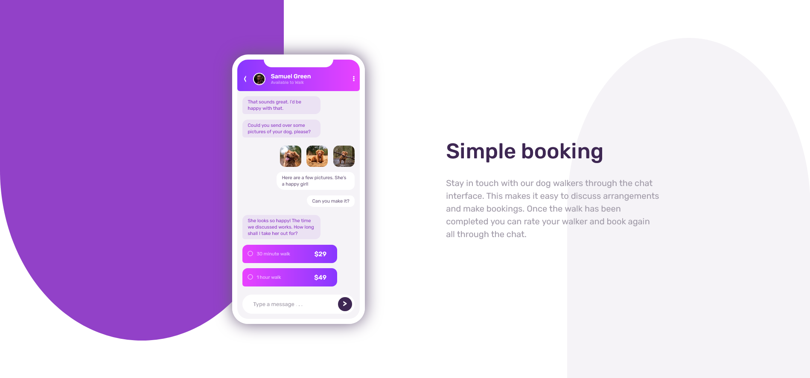

# Frontend Mentor - Chat app CSS illustration solution

This is a solution to the [Chat app CSS illustration challenge on Frontend Mentor](https://www.frontendmentor.io/challenges/chat-app-css-illustration-O5auMkFqY). Frontend Mentor challenges help you improve your coding skills by building realistic projects. 

## Table of contents

- [Overview](#overview)
  - [The challenge](#the-challenge)
  - [Screenshot](#screenshot)
  - [Links](#links)
- [My process](#my-process)
  - [Built with](#built-with)
  - [What I learned](#what-i-learned)
  - [Continued development](#continued-development)
  - [Useful resources](#useful-resources)
- [Author](#author)

## Overview

### The challenge

Users should be able to:

- View the optimal layout for the component depending on their device's screen size
- **Bonus**: See the chat interface animate on the initial load

### Screenshot

### Links

- Solution URL: [GitHub repo](https://github.com/KrzysztofLeczycki/chat-app-css-illustration)
- Live Site URL: [GitHub page](https://krzysztofleczycki.github.io/chat-app-css-illustration)

## My process

### Built with

- Semantic HTML5 markup
- SCSS
- Flexbox
- CSS Grid
- Mobile-first workflow

### What I learned

I tried becoming more comfortable with SCSS features such as `@for`, `@mixins` and `@if`. These at-rules were very useful in reducing the amount of animations code.

### Continued development

I am focusing on improving my styling skills and learning React.

### Useful resources

- [SASS docs](https://sass-lang.com/documentation).
- [MDN](https://developer.mozilla.org/en-US/docs/Web/CSS/animation-fill-mode) - The erticle about CSS animations.

## Author

- Website - [Krzysztof Łęczycki](https://krzysztofleczycki.github.io/portfolio/)
- Frontend Mentor - [@KrzysztofLeczycki](https://www.frontendmentor.io/profile/KrzysztofLeczycki)
